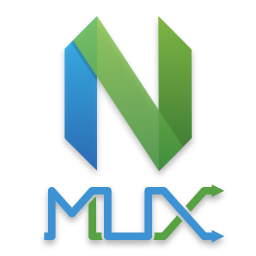

<h1 align=center></h1>

`nmux` is a multiplexer for [Neovim][] processes.  It is very much a work in
progress at the moment.

It currently has a built-in HTTP server that renders a single `nvim` process in
your browser using websockets as a proof-of-concept.  Short video of `nvim`
rendered in a browser: https://youtu.be/mzfHBPHkT-E

The browser client was made mainly for prototyping.  Native GUI clients for
Linux, macOS, and Windows are being worked on.

## Requirements

[Neovim][] must be installed and `nvim` available in `$PATH`.


## Install

There is an [unstable][] Darwin (macOS) binary available.
Windows and Linux builds will be available in the future.

You can also install it with Go:

```
$ go get -u github.com/tweekmonster/nmux/cmd/nmux
```

## Usage

To run the server:

```
$ nmux --server --addr localhost:9999
```

To use Neovim in a browser, go to
[http://localhost:9999/](http://localhost:9999/)

**Note**: The browser client has been tested and works in Google Chrome.  The
keyboard currently doesn't work in Firefox or Safari.  If you're using an
extension that gives you vi functionality, it will need to be disabled.

If you're using the Darwin release:

```
$ nmux.app/Contents/MacOS/nmux --server --addr localhost:9999
```

Then run `nmux.app` to connect to the server.  If you're using a port other
than `9999`, you will need to run the client the same way, but without the
`--server` flag.  A future release will allow you to configure a remote server
and optionally spawn a local server.


## Goals

- A server that manages multiple `nvim` processes.
  - Allow clients to connect over TCP.
  - Shared unnamed register between all `nvim` processes.
- Native cross-platform client programs.
  - Each `nvim` instance can be a tab or a split view.
  - UI is always consistent.  No platform-specific GUI elements, except for the
    title bar.
  - Image replacements for glyphs (in-editor icons).
  - Basic OS integration (clipboard, notifications, open URLs, etc.)
- "Simplified" configuration.
  - Only basics need to be configured for client programs.
    - Client programs can be scripted and configured via vimscript.
  - No need to configure a terminal emulator or tmux.  `nvim` can already be
    configured and scripted to no end.

The ultimate goal is to create native client apps that connect to the `nmux`
server, making the terminal emulator an obsolete program in my daily work.
This is not an attempt to create a new terminal emulator—`nvim` already has
reliable terminal emulator built-in through [libvterm][].

This will make it possible to turn a Docker container or Virtual Machine
(possibly even WSL) into your "IDE".  You could take a snapshot of your
workspaces and resume where you left off after a reboot.


[Neovim]: https://github.com/neovim/neovim
[unstable]: https://github.com/tweekmonster/nmux/releases/tag/unstable
[libvterm]: https://github.com/neovim/libvterm
